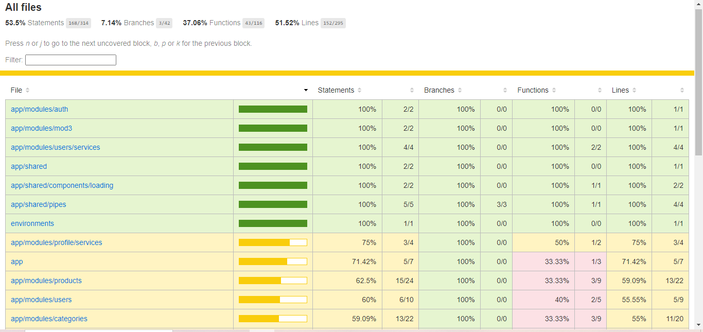

# Angular 16 Dashboard

Angular 16 based project to demonstrate basic and advanced knowledge of the framework.

It is a user panel for the management and administration of products, categories and supermarkets.

## Requirements

Make sure you have the following programs installed before running the application:

- [Node (v22.2.0)](https://nodejs.org/en)
- [Angular CLI (v16.2.10)](https://angular.io/cli)
- [Git (Latest)](https://git-scm.com/)

## Install

Run the next command for install and setting project.

```bash
git clone https://github.com/AndresOrozcoDev/angular-16-dashboard.git
cd angular-16-dashboard.git
```

```bash
npm i
```

## Development server

Run the next command for a dev server. Navigate to `http://localhost:4200/`. The application will automatically reload if you change any of the source files.

```bash
ng serve
```

## Code scaffolding

Run the next command for generate a new component with lazy loading.

```bash
ng generate module modules/[name-module] --route [name-path] --module [name-module-main]
ng g m modules/mod# --route mod# --module app.module.ts

```

## Deployment

Run the next command for build the project. The build artifacts will be stored in the `dist/` directory.

```bash
ng build
```

## Running unit tests

Run the next command for execute the unit tests via [Karma](https://karma-runner.github.io).

```bash
ng test
```

## Running unit tests with coverage

Run the next command for execute the unit tests via [Karma](https://karma-runner.github.io) The report is a bunch of HTML files you can open with a browser. Start by opening `coverage/index.html` in the browser of your choice.

```bash
ng test --code-coverage
```



## Running end-to-end tests

Run the next command for execute the end-to-end tests via a platform of your choice. To use this command, you need to first add a package that implements end-to-end testing capabilities.

```bash
ng e2e
```

## Further help

To get more help on the Angular CLI use `ng help` or go check out the [Angular CLI Overview and Command Reference](https://angular.io/cli) page.

## Architecture

```bash
src/
|-- app/
|   |-- core/
|   |-- shared/
|   |   |-- components/
|   |   |-- directives/
|   |   |-- guards/
|   |   |-- interceptors/
|   |   |-- pipes/
|   |   |-- services/
|   |-- modules/
|   |   |-- module1/
|   |   |   |-- components/
|   |   |   |-- models/
|   |   |   |-- services/
|   |   |   |-- module1-routing.module.ts
|   |   |   |-- module1.module.ts
|   |-- app-routing.module.ts
|   |-- app.component.ts
|   |-- app.module.ts
|-- assets/
|-- environments/
```

## Technology Stack and Features

- ⚡ [**Angular**](https://fastapi.tiangolo.com) for the frontend version 16.2.10.
    - 🎨 [Boostrap 5](https://getbootstrap.com/) for styles.
    - 🔍 [Font awesome](https://fontawesome.com/search?m=free&o=r) for icons.
    - 🧰 [Google fonts](https://fonts.google.com/specimen/DM+Sans) for family font.
    - ✅ [Karma](https://karma-runner.github.io) for unit test.
- 🐋 [**Docker**](https://www.docker.com) for development and production.

## Author

[@AndresOrozcoDev](https://github.com/AndresOrozcoDev)